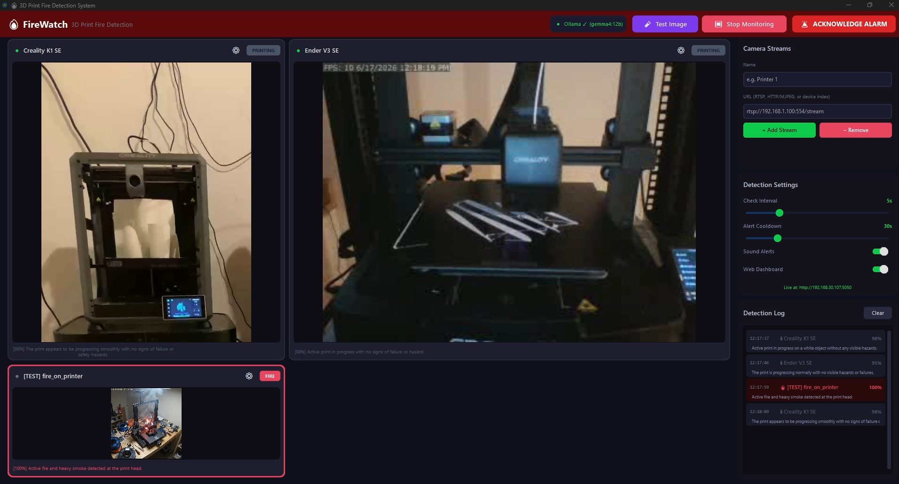

# FireWatch

<p align="center">
  
</p>

**FireWatch** is a professional-grade, 100% local, and fully private edge-AI fire detection and monitoring system designed specifically for 3D printers. 

Unlike commercial solutions that require cloud subscriptions and send your private camera feeds over the internet, FireWatch runs locally on your own hardware. It leverages state-of-the-art **Large Vision Models** (via Ollama) coupled with high-frequency **Computer Vision** motion tracking to continuously analyze your printer streams. It ignores normal LED glare and intelligently detects active fires, smoke, thermal anomalies, failed prints (spaghetti monsters), and successful job completions.

**Say goodbye to the anxiety of long overnight prints.** With FireWatch standing guard, you can finally sleep soundly knowing you won't wake up (or rather, *not* wake up) to an inferno in your workspace.

---

## Key Features

- **Edge-AI Vision**: Powered locally by `Gemma 4 12B` (or your preferred Ollama vision model) for true multimodal scene understanding—not just basic OpenCV pixel matching.
- **Universal Camera Support**: Monitor multiple printers simultaneously using direct RTSP streams or HTTP MJPEG feeds.
- **Surgical Cropping (Zoom & Pan)**: Crop out irrelevant background details or blinding LED strips from your camera feeds so the AI focuses *only* on the build plate and toolhead.
- **Embedded Web Dashboard**: A built-in, togglable Flask dashboard allows you to monitor all your streams and detection logs live from your smartphone or tablet on the same local network.
- **Continuous Alarm System**: If a fire is detected, a high-visibility continuous alarm and siren will trigger, remaining active until you physically acknowledge it. 
- **Desktop-Class UI**: Built with `CustomTkinter` and heavily multithreaded. The GUI remains butter-smooth while the background threads handle heavy OpenCV video decoding and AI inference.
- **Forensic Logging**: Automatically saves the exact cropped frame that triggered an alarm to disk for later review.
- **Spaghetti Detection**: Intelligently identifies print failures, massive stringing, and knocked-over models.
- **Job Completion Engine**: Runs a dedicated high-frequency OpenCV motion-tracking thread to flawlessly detect when a print has finished and the toolhead has parked.

---

## Getting Started

### Hardware Recommendations
Because FireWatch relies on running a Large Vision Model (LVM) locally, your inference speed and stream capacity will depend heavily on your GPU. 

**Real-World Benchmark (using `gemma4:12b`):**
- **GPU**: Nvidia RTX 5070 Ti (16GB VRAM)
- **VRAM Usage**: ~12.3 GB
- **Performance**: Handled 2 simultaneous camera streams effortlessly with an average inference time of ~3 seconds.

If you are running on lower-end hardware, we highly recommend opening `firedetection.ini` and swapping your model to a smaller, more optimized vision model like `llava:7b` or `moondream` to ensure fast inference times and prevent out-of-memory errors.

### Prerequisites
1. **Ollama** installed and running as a background service.
2. Pull your preferred vision model via terminal: `ollama run gemma4:12b` (or swap to `llava`, `moondream`, etc., in the settings).

### Installation (Windows — Recommended)

The easiest way to get FireWatch running is with the pre-built executable. No Python required.

1. **Download / clone this repository** and locate the `dist/FireWatch` folder.
2. **Copy the entire `FireWatch` folder** to a safe, permanent location on your PC (e.g. `C:\Program Files\FireWatch` or `C:\Tools\FireWatch`).
3. **Create a Desktop shortcut:**
   - Navigate into your `FireWatch` folder and find `FireWatch.exe`.
   - Right-click → **Create shortcut**.
   - Move the shortcut to your Desktop.
4. **Double-click the shortcut** to launch FireWatch. That's it!

> **Tip:** If Windows SmartScreen blocks the app on first launch, click **"More info"** → **"Run anyway"**. This is normal for unsigned executables.

### Alternative: Running from Python (Mac / Linux / Advanced Users)

If you're on **macOS or Linux** (where the `.exe` won't work), or you prefer running from source:

1. Make sure you have **Python 3.10+** installed.
2. Clone the repository:
   ```bash
   git clone https://github.com/yourusername/FireWatch.git
   cd FireWatch
   ```
3. Install the required Python dependencies:
   ```bash
   pip install -r requirements.txt
   ```
4. Run the application:
   ```bash
   python main.py
   ```

---

## Setting Up Cameras

You don't need expensive dedicated IP cameras to use FireWatch! You can easily repurpose an old smartphone, tablet, or laptop into a networked camera. Ensure the device is connected to the **same local area network (LAN)** as the machine running FireWatch.

**Using an Old Phone or Tablet:**
- Download an app like **OctoStream** (or any IP webcam app).
- This will turn your device into a networked camera. Note the IP address and video stream URL provided by the app, and add it directly into FireWatch.

**Using an Old Laptop:**
- Install **iSpyAgent DVR** on the laptop.
- Add your laptop's built-in webcam as a "Local Device" source and enable it.
- Click the server icon in the top right corner to find the laptop's IP address.
- Your video feed URL will be that IP address with `/video.mjpg` tacked onto the end (e.g., `http://192.168.1.50:8090/video.mjpg`).

*(You are also welcome to use any other network camera software or real hardware IP cameras!)*

---

## How It Works

FireWatch utilizes a dedicated background `DetectionEngine` thread. Every few seconds (configurable), it reaches into the multithreaded `StreamManager`, grabs the most recent decoded video frame, applies your custom Zoom/Pan crop coordinates, encodes it to Base64, and sends it to your local Ollama vision model alongside a highly optimized prompt designed specifically to ignore 3D printer artifacts (like toolhead LEDs and reflections).

---

## Roadmap / Future Features
- [ ] **Hardware Triggers**: Execute system commands or webhooks (like shutting down a smart plug) upon fire detection.

---
*Created by Will for the 3D Printing Community. Stay safe!*
